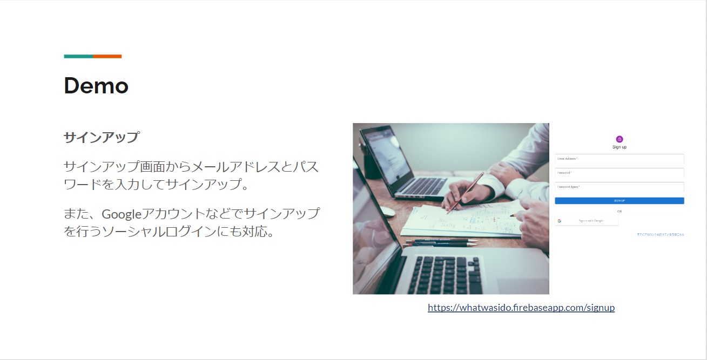
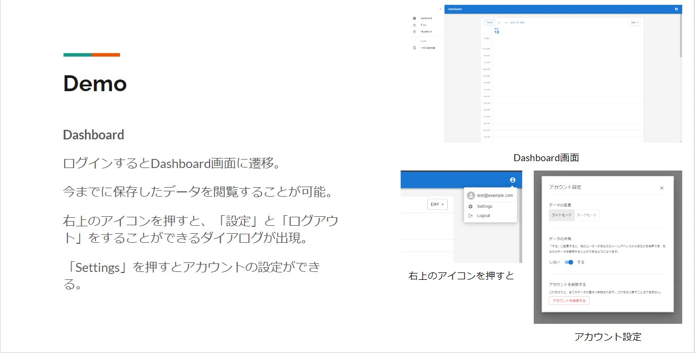
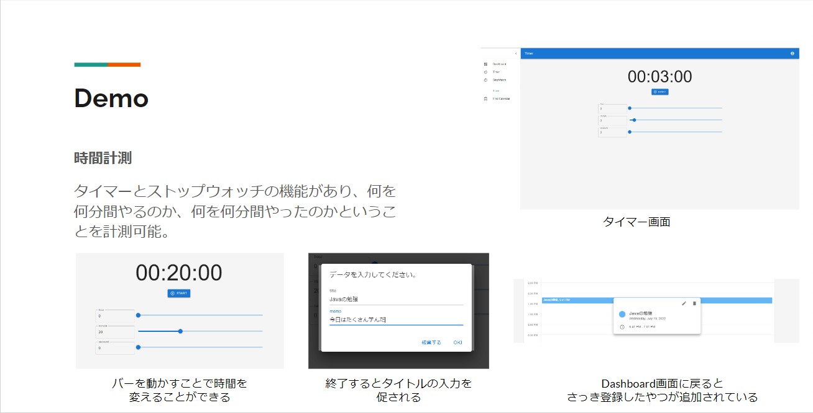
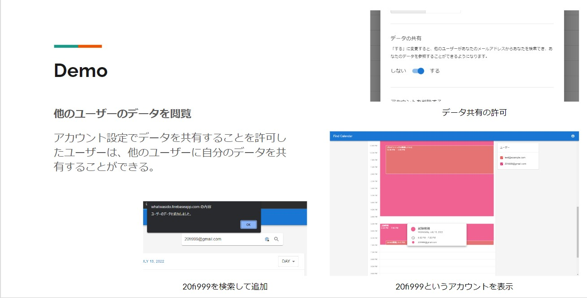

# WhatWasIDo
アプリ名：「WhatWasIDo」

いつ何を何時間やっていたのか保存するWebアプリ

例えば、「7月7日の12:00 ～ 13:00の間にプログラミングの勉強をしていた」ということなどを保存していき、後で見返した時に、どの程度の生産性があったのかなどを確かめることができるアプリ。将来的な計画を立てることが主な目的ではなく、実際に何時間やったのか、何をしていたのかを保存することができる。

自分のログを保存するようなものである。

# Demo
[実際のページ](https://whatwasido.firebaseapp.com/) 
↑　2023/02/26に停止

### サインアップ

### Dashboardページ

### 時間計測

### 他のユーザーのデータを閲覧

# Features

作成動機としては、日々プログラミングの勉強などをしていくうえで「何時間やっていたのだろう」とか、「この勉強に今まで何時間費やしたのだろう」ということを知りたかったという事である。よくあるタスク管理系のアプリは、将来的なタスクを作成することはできるが、実際それをどれぐらいやったのか、ということを保存できる機能を持つものは少なかった。特に、ストップウォッチやタイマーなどで何時間やっていたのかを計れるかつ、その結果をカレンダーなど視覚的に分かりやすく表示できるというものは自分の探した中では無かった。無いのならば自分で作ろうということで今回このプログラムの制作をした。

また、ReactやFirebaseなどを使って何かWebアプリを作りたいとも思っていたので、この機会にそれらも経験することにした。そのため、React及びTypeScript、Firebaseを用いたプログラム制作はこれが初めてである。

### アピールポイント
- ライトモード、ダークモードの実装 
  ユーザーの好みに応じて、ライトモードとダークモードの切り替えを行うことができる。

- 他のユーザーのデータを閲覧できる、自分のデータを他のユーザーへ共有できる 
  データの共有を許可しているユーザーのデータを検索し閲覧することができる。

- ソーシャルログインの実装 
  最近よく見かける「Googleでログイン」などのソーシャルログイン機能の実装に挑戦

# Rquirement

## Language
- TypeScript
- (HTML, CSS, SCSS, JavaScript)

## Library
- React
- Material UI
  - Devexpress Scheduler

## Other
- Firebase
  - Authentication
  - cloud Firestore
  - Hosting

# Usage

※FirebaseのAPI Keyはアップしてないので、基本的にローカルでは動かせない。

実際に動かしたい場合は[こちら](https://whatwasido.firebaseapp.com/)(2023/02/26に停止)からお願いします。

1. `yarn install`
2. `yarn start`でローカルサーバーの起動
3. `yarn build`でbuildファイルの作成

# Notes

`firestore.rules`はセキュリティ面を考えるとアップするべきではないと思いますが、ポートフォリオとしての側面もあるので、今回はアップしています。